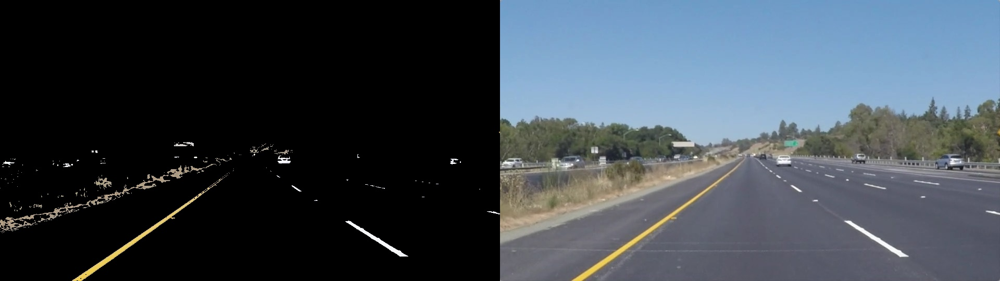
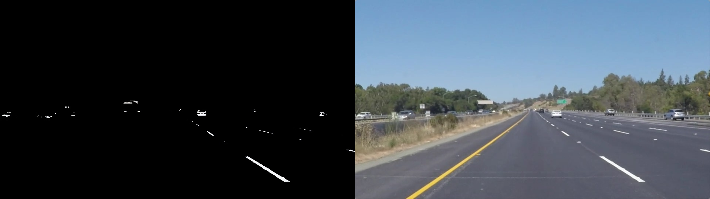
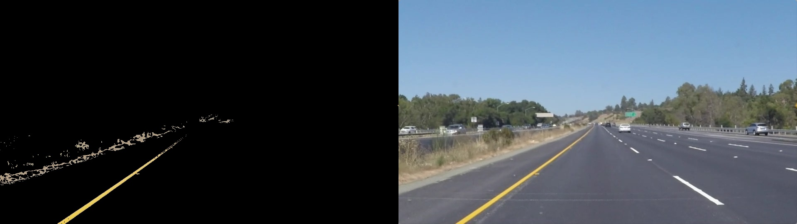
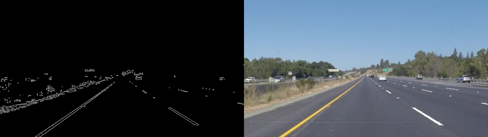
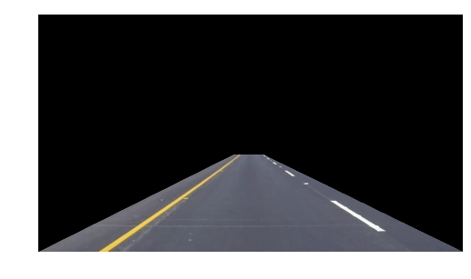
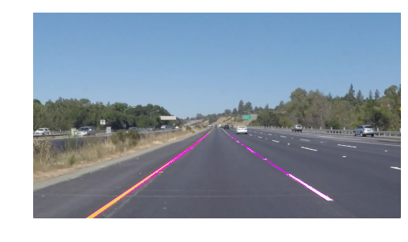
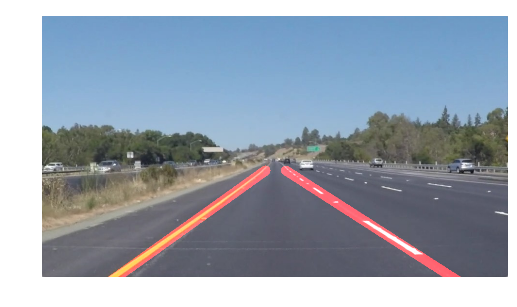

# **Finding Lane Lines on the Road** 
***

In this project, you will use the tools you learned about in the lesson to identify lane lines on the road.  You can develop your pipeline on a series of individual images, and later apply the result to a video stream (really just a series of images). Check out the video clip "raw-lines-example.mp4" (also contained in this repository) to see what the output should look like after using the helper functions below. 

Once you have a result that looks roughly like "raw-lines-example.mp4", you'll need to get creative and try to average and/or extrapolate the line segments you've detected to map out the full extent of the lane lines.  You can see an example of the result you're going for in the video "P1_example.mp4".  Ultimately, you would like to draw just one line for the left side of the lane, and one for the right.


The following animation shows the final result of lane line finding


## Pipeline 

The purpose of the pipeline is to compose several different operations together, apply them to an image and produce an anotated image shows where a lane on a road would be.

My pipeline consists of multiple steps:

1. Applying a color mask
2. Performing edge detection
3. Selecting region interests to detect lane lines
4. Using the Hough transform to find line segments
5. Extrapolate the line segments to map out full extent of the lane lines


## Applying a color mask


Lanes on the road are typically found as a single color and we can apply the color mask function to an image to remove all colors except those we want to specify.

For this project I created two masks: one for while lanes and one for yellow lanes

---
#### white lane



I found white lane showed on this example image looked good enough and provided good results when ran against other example images.


---
#### yellow lane


The yellow lane was a little bit complicated since the color has taken into account. By using **cv2.cvtColor( )** to convert the image from BGR colorspace to HSV,I was able to create a mask that isolated the yellow lane.


## Performing edge detection


This step is very simple, just applying the function of **cv2.Canny(image,low_threshold, high_threshold)**  to pull out edges in the image.

## Selecting region interests to detect lane lines


After performing edge detection, we found there were still irrelevant edges remained, however, applying a region of interest mask (using **cv2.fillPoly( )** function) to filter out detected line segments in other areas of the image would be a good way to accomplish this.  


## Using the Hough transform to find line segments


The hough transform is the operation in the pipeline that actually finds line segments in an image. we'll be using an OpenCV function called **HoughLinesP** that takes several parameters. 

A large amount of time was spent tweaking the parameters and manually tuning the hough transform to provide good results.


## Extrapolate the line segments to map out full extent of the lane lines


Once we have the line segments produced by the hough transform, we can define a line to run the full length of the visible lane by using the **draw_lines** function.

Initially,I just tried to feed all points and the adjusting parameters of min_line_len and max_line_gap to the draw_lines function, but found that the test video performed much messy. When I adjusted the pipeline to instead seperate lines into two groups (right line and left line), it significantly increased performance that those continuous red lines tracing so well. 


```python

```
